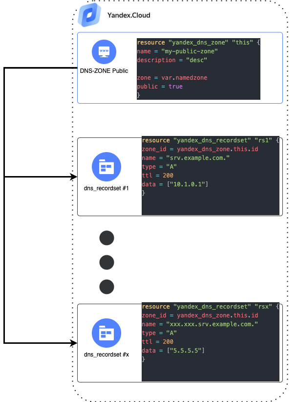

# Cценарий по настройке DNS-зон


## Установка YC-CLI
Для устанвки YC CLI можно использовать следующий гайд [YC CLI](https://cloud.yandex.ru/docs/cli/quickstart)


## Авторизация терраформ-провайдера через YC
```bash
export YC_TOKEN=$(yc iam create-token)
export YC_CLOUD_ID=$(yc config get cloud-id)
export YC_FOLDER_ID=$(yc config get folder-id)
```

## Схема решения

Плейбук разворачивает следующую инфраструктуру:



<br/>

## Описание компонентов
- **dns.tf** - разворачивает нужную публичную зону и создает в ней требуемые записи


## Развертывание плейбука
Создайте файл terraform.tfvars и заполните переменную "namedzone"
##### Например:
```bash
namedzone = " mydomain-example.com."
```

Для каждой записи в исходном zonefile необходимо создать recordset объект и заполнить его поля

##### Например в zonefile может быть запись: 

```
555.storage.mydomain-example.com.		IN	A	5.5.5.5	
```

Для создания зоны и записи ваш файл dns.tf будет выглядеть вот так:
```HCL
resource "yandex_dns_zone" "this" {
  name        = "my-public-zone"
  description = "desc"

  zone             = var.namedzone
  public           = true
}

resource "yandex_dns_recordset" "rs1" {
  zone_id = yandex_dns_zone.this.id
  name    = "555.storage.mydomain-example.com."
  type    = "A"
  ttl     = 3600
  data    = ["5.5.5.5"]
}
```

##### Если нужно добавить еще одну запись, добавьте еще один блок типа recordset 

```HCL

resource "yandex_dns_recordset" "rs2" {
  zone_id = yandex_dns_zone.this.id
  name    = "777.server.mydomain-example.com."
  type    = "A"
  ttl     = 3600
  data    = ["5.5.5.2"]
}
```
И так далее

#### Вызов терраформа
```bash
terraform init
terraform plan
terraform apply
```

## Валидация плебука
Проверяем что нужные записи корректно резолвятся 
```bash
nslookup 777.server.mydomain-example.com. ns1.yandexcloud.net
```
## Удаляем инфраструктуру
```bash
terraform destroy
```